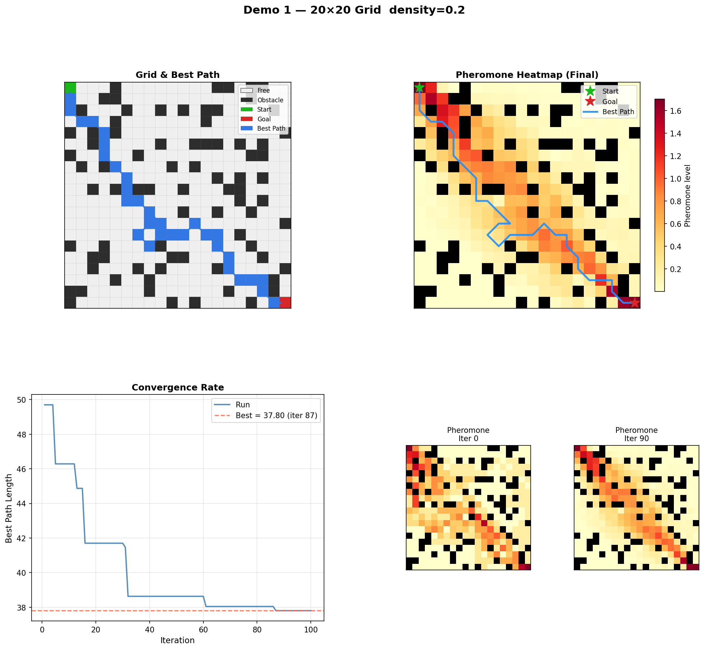
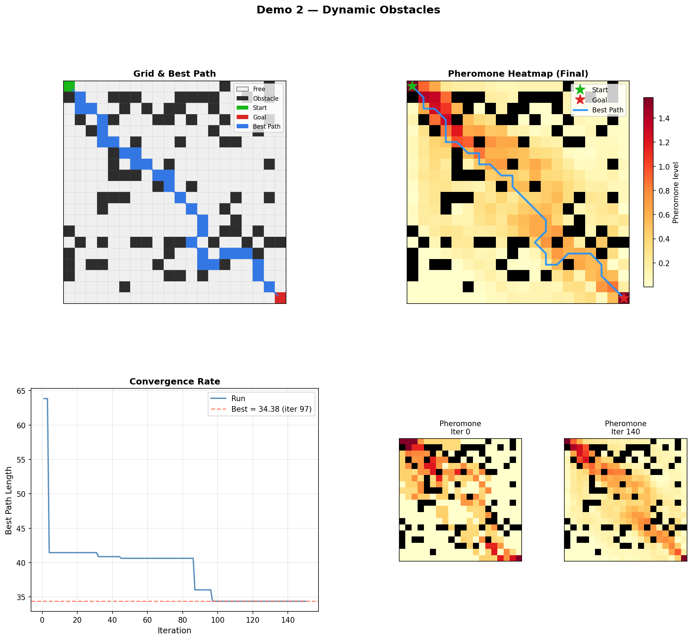
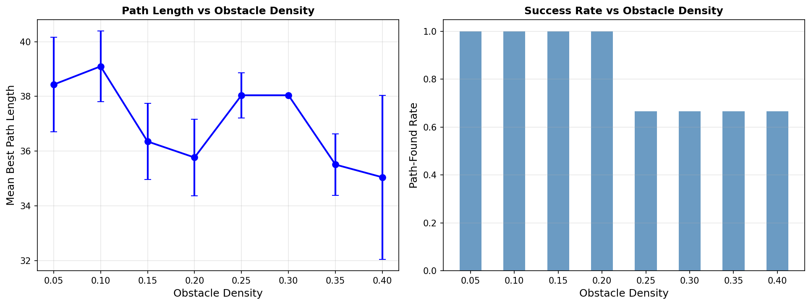
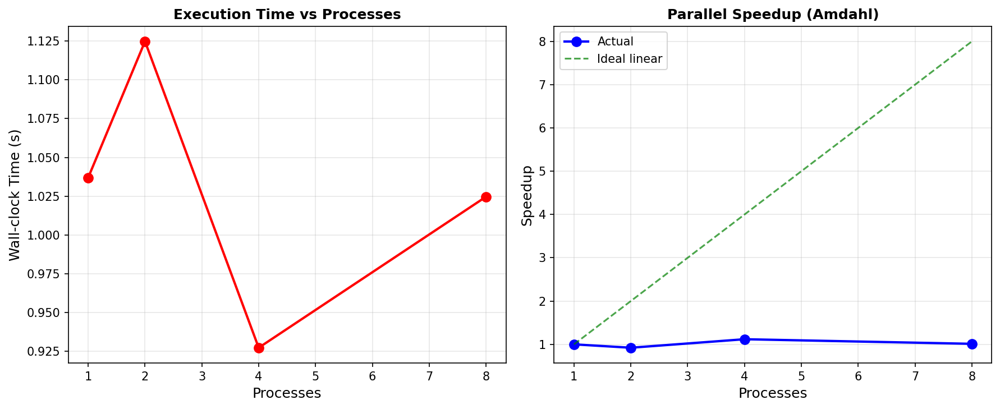

# ACO Grid-Based Robot Path Planning with Obstacles

> Group 2 — Parallel and Distributed Computing (Semester 6)

A parallelized **Ant Colony Optimization (ACO)** pathfinder that guides a robot
across a 2D grid from a start cell to a goal cell while avoiding obstacles.
Each ant explores independently, so path construction is **parallelized** — using
`multiprocessing` in Python (to bypass the GIL) and `#pragma omp parallel for`
in the C/OpenMP version.


<p align="center"><em>The live web dashboard: a 20×20 grid with the pheromone heatmap (orange),
the converged best path from start (S) to goal (G) in blue, and the convergence curve on the right.</em></p>

The project ships with:

- A **command-line demo suite** (`main.py`) that runs four experiments and saves plots.
- An **interactive web frontend** (`server.py` + `frontend/`) that streams the
  ant search live in the browser via Server-Sent Events.
- A **C / OpenMP** implementation (`c_src/`) demonstrating the same algorithm with
  shared-memory parallelism.

## Features

- **Parallel ACO solver** — ants explore independently, so each iteration's path
  construction is distributed across CPU cores via `multiprocessing.Pool`.
- **Interactive web app** — tune grid size, obstacle density, ant/iteration counts
  and the `alpha`/`beta`/`rho` hyper-parameters with live sliders, then watch the
  colony converge in real time.
- **Editable grid** — click any cell to toggle an obstacle, or regenerate a random
  layout from a seed.
- **Pheromone heatmap** — see where the colony is laying down trails, updated every
  iteration.
- **Dynamic obstacles** — optionally inject new walls mid-run and watch the path re-route.
- **Live convergence chart and stats** — best path length, valid-ant count, and
  per-iteration timing stream in as the search runs.
- **Speedup benchmarking** — measure sequential vs multi-process runtime.

## Live web interface

Run `python server.py` and open <http://localhost:5000>. The grid is fully
interactive — adjust parameters on the left, preview a layout, and click **Run ACO**
to stream the search live.

<p align="center">
  
</p>

<p align="center"><em>Close-up of a solved 20×20 grid — brighter orange cells carry more pheromone,
and the blue line is the shortest obstacle-free path the colony found.</em></p>

## Demo results (CLI)

Running `python main.py` saves these four Matplotlib figures to `output/`:

| Basic parallel ACO | Dynamic obstacles |
|---|---|
|  |  |

| Path length vs density | Parallel speedup |
|---|---|
|  |  |

## Project structure

```
.
├── main.py            # CLI entry point — runs the 4 demos, saves plots to output/
├── aco_grid.py        # Core ACO algorithm + Grid model (parallelized with multiprocessing)
├── evaluation.py      # Density and parallel-speedup experiments
├── visualization.py   # Matplotlib dashboards and plots
├── server.py          # Flask dev server + SSE API for the web frontend
├── frontend/
│   └── index.html     # Interactive browser UI (grid editor + live ant search)
├── c_src/             # C / OpenMP implementation
│   ├── aco.c / aco.h  # ACO solver (parallel ant loop)
│   └── grid.c / grid.h
├── output/            # Generated demo plots
├── docs/screenshots/  # Web-app screenshots used in this README
└── requirements.txt
```

## Requirements

- Python 3.9+ (developed on 3.11)
- Packages in [`requirements.txt`](requirements.txt): `numpy`, `matplotlib`, `flask`

```bash
pip install -r requirements.txt
```

## Usage

### 1. Run the demo suite (CLI)

```bash
python main.py            # full run — saves 4 plots to ./output/
python main.py --quick    # reduced iterations for a fast smoke test
```

This runs:
1. **Basic parallel ACO** — full dashboard on a 20×20 grid.
2. **Dynamic obstacles** — new walls injected mid-run; the colony re-routes.
3. **Density evaluation** — path length vs obstacle density.
4. **Parallel speedup** — sequential vs multi-process timing.

### 2. Run the interactive web app

```bash
python server.py
```

Then open <http://localhost:5000>. You can set grid size, obstacle density,
ant/iteration counts, and ACO hyper-parameters (`alpha`, `beta`, `rho`), then
watch the search converge live.

### 3. Build & run the C / OpenMP version

The C sources in `c_src/` implement the solver with an OpenMP-parallel ant loop.
Compile with OpenMP enabled, e.g.:

```bash
gcc -O2 -fopenmp c_src/aco.c c_src/grid.c -lm -o aco
```

> Note: `c_src/` provides the parallel solver and grid modules. Wire them into
> your own `main` (or driver) to run standalone benchmarks.

## How it works

Ant Colony Optimization is a swarm-intelligence metaheuristic. Many simple
"ants" build candidate paths probabilistically, biased by:

- **Pheromone** (`alpha`) — learned desirability of a move, reinforced by good paths.
- **Heuristic** (`beta`) — greedy pull toward the goal.

After each iteration, pheromone **evaporates** (`rho`) and the best paths deposit
more pheromone, so the colony converges on short, obstacle-free routes. Because
each ant's walk is independent, the per-iteration ant exploration is the natural
unit of parallelism — which is exactly what this project parallelizes and
benchmarks.

## License

Released under the [MIT License](LICENSE).
